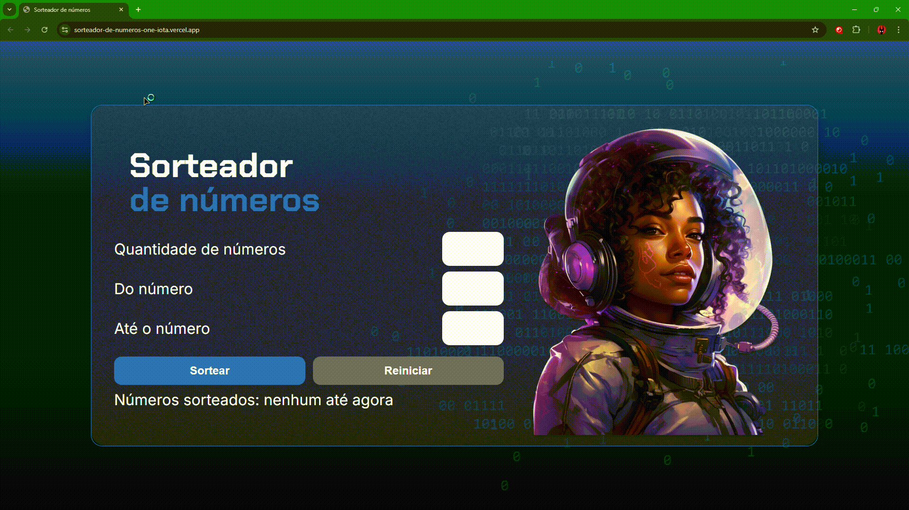

# 🎲 Sorteador de Números

## 📰 Descrição

Primeiro projeto do último curso de Lógica de Programação da Alura

Esse projeto apresenta um **sorteador de números**, onde você escolhe a quantidade de números gerados entre dois números (também determinados pelo usuário)

> Com uma estrutura em JS mais complexa, esse projeto utiliza-se de Arrays, funções, estruturas de condição e repetição, DOM... 
> - Além do código ser feito **buscando trazer soluções e respostas individualmente (pouca consulta ao material disponível)**, também há alterações opcionais no HTML **(criação de uma "label" que informa ao usuário quando todos números possíveis foram gerados)**

## 🔗 Link para vizualização

## 💻 Tecnologias Utilizadas
`Trabalhado durante o curso:`

 

`Modificado para novas implementações OPCIONAIS:`

`Desenvolvido anteriormente pela Alura:`

 

## 🏅 Certificado de Conclusão 

## 🙋 Autores
[    Gabriel Possato ](https://github.com/possatogabriel)
 
 

    

